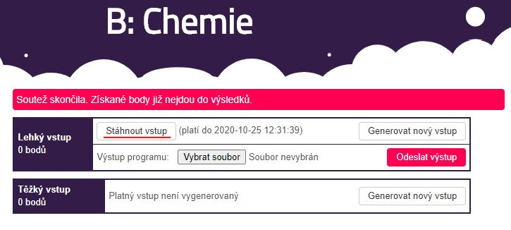
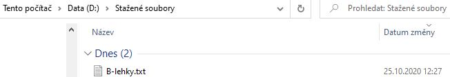

# Významy souborů

### in.txt ###
* vstup programu

### out.txt ###
* výstup programu

# Slozky.ps1
Skript pro vytvoření složky s 8 podsložkami a 2 textovými soubory pro využití s následujícím skriptem.

<kbd></kbd>

# Vstup.ps1
Skript pro zkopírování obsahu ze vstupního souboru, který si u každé úlohy stáhneme (např. A-lehky.txt), a pro následné vložení do **in.txt** dané úlohy. Stažený soubor se pak automaticky odstraní.

## 1. Vstup si stáhneme 
* např. B-lehky.txt

<kbd></kbd>

## 2. Vstup si uložíme do D:/Downloads 
* máte-li stažené soubory na disku **C:**, stačí ve skriptu nahradit **D:/** za **C:/**

<kbd></kbd>

### Ukázka skriptu

<kbd></kbd>

## Programovací soutěž [Kasiopeia](https://kasiopea.matfyz.cz) 
